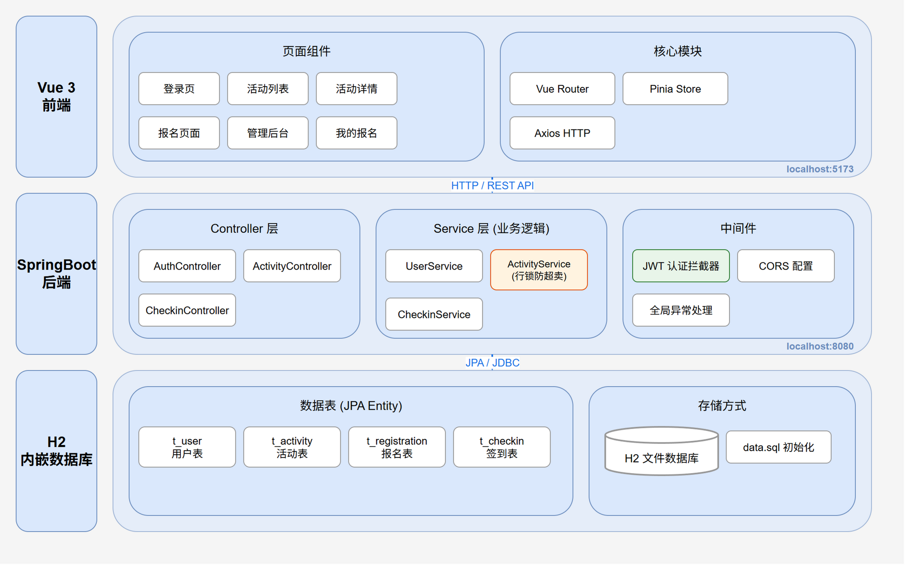
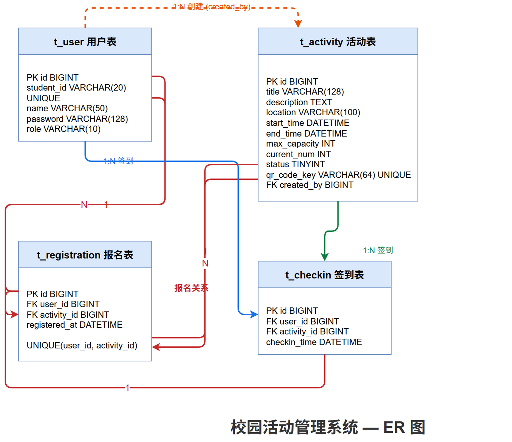

# 校园活动管理系统

## 技术栈

| 层级 | 技术 |
|------|------|
| **后端** | Java 21, SpringBoot 3.2, Spring Data JPA, JWT |
| **前端** | Vue 3, Vite, Vue Router, Pinia, Axios |
| **数据库** | H2 内嵌数据库（无需安装，开箱即用） |
| **认证** | JWT 无状态认证 |

> 系统完全离线运行，不依赖任何外部网络服务。

## 本地部署步骤

### 环境要求

- Java 21+
- Node.js 18+

### 1. 启动后端

```bash
cd backend

# Windows (PowerShell)
./mvnw.cmd clean package -DskipTests
java -jar target/activity-system.jar

# Mac / Linux
./mvnw clean package -DskipTests
java -jar target/activity-system.jar
```

后端启动后在 `http://localhost:8080` 监听。

> **注意：** 系统使用 H2 内嵌数据库，首次启动自动建表并插入测试数据。数据文件会保存在 `backend/data/` 目录下。

### 2. 启动前端

```bash
cd frontend
npm install
npm run dev
```

前端启动后在 `http://localhost:5173` 打开浏览器访问。

## 测试账号

| 角色 | 学号 | 密码 |
|------|------|------|
| 管理员 | admin | 123456 |
| 普通学生 | stu001 | 123456 |
| 后端开发者 | 223401010135 | 123456 |
| 前端开发者 | 223401010122 | 123456 |

## 系统架构图



## 数据库 ER 图



## 项目结构

```
campus-activity-system/
├── backend/                     # SpringBoot 后端
│   ├── src/main/java/com/campus/activity/
│   │   ├── Application.java     # 启动入口
│   │   ├── config/              # JWT / CORS / 拦截器配置
│   │   ├── controller/          # REST API 控制器
│   │   ├── service/             # 业务逻辑层
│   │   ├── repository/          # JPA 数据访问层
│   │   ├── entity/              # 实体类
│   │   ├── dto/                 # 数据传输对象
│   │   └── common/              # 全局异常处理
│   └── src/main/resources/
│       ├── application.yml      # 应用配置
│       └── data.sql             # 测试数据
├── frontend/                    # Vue 3 前端
│   └── src/
│       ├── views/               # 页面组件
│       ├── router/              # 路由配置
│       ├── stores/              # Pinia 状态管理
│       ├── api/                 # Axios HTTP 请求
│       └── assets/              # 静态资源
├── doc/
│   ├── images/                  # 架构图 / ER图
│   └── sql/                     # 数据库脚本
│       ├── schema.sql           # 建表语句
│       └── data.sql             # 测试数据
└── README.md                    # 本文件
```
